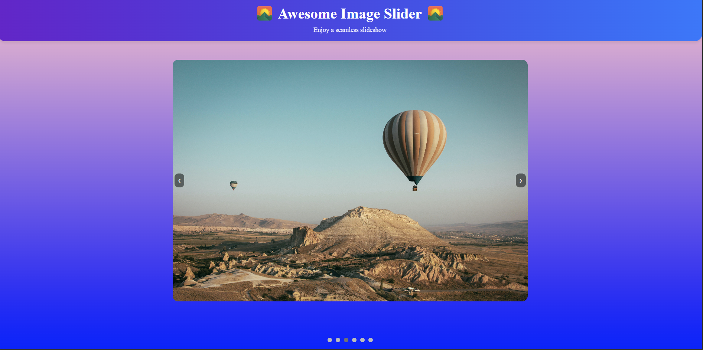
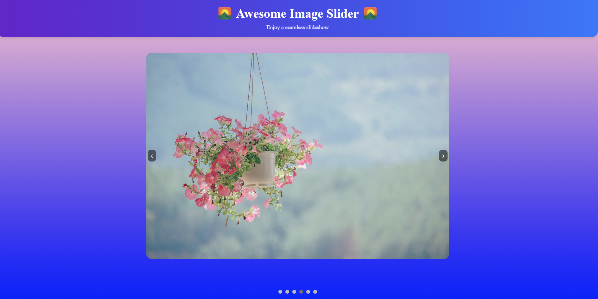

# ImageCarousel
website Link : https://neelbiswas123.github.io/ImageCorousel/

**ImageCarousel** is a lightweight, infinite image carousel built using **HTML, CSS, and JavaScript**. It smoothly transitions through **six images** in an endless loop, perfect for showcasing content dynamically.

## 🚀 Features
- **Infinite Loop:** Seamless transitions between images.
- **Responsive Design:** Works smoothly on various screen sizes.
- **Customizable Speed:** Adjust animation duration easily.
- **Lightweight & Simple:** No external dependencies required.
- **Easy Integration:** Plug and play with minimal setup.

## 🛠️ Technologies Used
- **HTML** – Structuring the carousel.
- **CSS** – Styling & animations.
- **JavaScript** – Handling transitions & interactivity.

## PREVIEW

